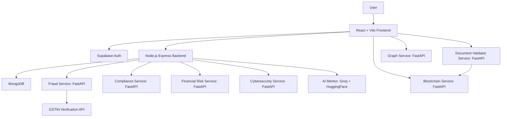

# AegisAI Interview Preparation Guide

## 1. One-Line Pitch

AegisAI is a multi-agent business risk intelligence platform that helps organizations detect invoice fraud, check contract compliance, validate document authenticity, assess financial distress, analyze suspicious URLs, visualize risk networks, and preserve important analysis records on a custom blockchain ledger.

Interview version:

> I built AegisAI as an AI-powered risk and compliance platform. It combines a React dashboard, an Express/MongoDB backend, multiple Python FastAPI ML services, Supabase authentication, and a custom blockchain audit ledger to analyze business documents and transactions for fraud, compliance, cybersecurity, and financial risk.

## 2. Problem Being Solved

Businesses handle invoices, contracts, financial statements, URLs, and identity or business documents. Manually reviewing these for fraud, compliance gaps, forgery, financial distress, or cyber threats is slow and error-prone.

AegisAI tries to solve this by centralizing risk checks into one platform:

- Invoice fraud detection for CSV, Excel, PDF, and manual invoice data.
- Contract compliance checking for required legal clauses.
- Document validation and forgery detection for uploaded images/PDF-like documents.
- Financial risk prediction using accounting ratios and ML support.
- Cybersecurity URL risk analysis.
- Graph-based vendor/company risk network visualization.
- Government-style national fraud dashboard.
- AI mentor that explains results in plain English.
- Blockchain audit trail for analysis results and document verification records.

## 3. High-Level Architecture

The frontend is the user interface. The Express backend is the main API gateway and persistence layer. MongoDB stores analysis history and results. Python FastAPI services perform the heavier AI/ML tasks. Supabase handles authentication. The blockchain service provides tamper-evident audit storage.

## 4. Tech Stack

Frontend:

- React 19 with Vite.
- React Router for page routing.
- Supabase JS client for login/register/session management.
- Axios/fetch for API calls.
- Lucide React for icons.
- Recharts for dashboard charts.
- react-force-graph-2d for network visualization.
- react-hot-toast for notifications.

Backend:

- Node.js and Express.
- MongoDB with Mongoose.
- Multer for uploads.
- Axios for calling Python services.
- Helmet, CORS, express-rate-limit for basic API hardening.
- Supabase JS and JWT parsing for user context.
- PDF/Excel/CSV libraries such as pdf-parse, exceljs, xlsx, csv-parser.
- Groq SDK and HuggingFace Inference for the AI mentor.

ML services:

- FastAPI and Uvicorn.
- scikit-learn, XGBoost, pandas, numpy, joblib.
- PyTorch/torchvision for document validation.
- SentenceTransformers for compliance embeddings.
- NetworkX for graph analysis.
- Tesseract OCR through pytesseract.

Blockchain:

- Custom Python blockchain implementation.
- Proof-of-work mining.
- SHA-256 hashing.
- Merkle root calculation.
- RSA signatures using cryptography.
- JSON file persistence.

Infrastructure:

- Docker Compose includes MongoDB, fraud service, backend, and frontend.
- Other services exist in the repo but are not fully wired into docker-compose.

## 5. Repository Structure

Important directories:

- `frontend/`: React dashboard, pages, components, API config, Supabase auth context.
- `backend/`: Express API server, routes, controllers, models, services, middleware.
- `ml-services/fraud-service/`: invoice fraud detection and OCR extraction.
- `ml-services/compliance-service/`: legal clause/compliance classifier.
- `ml-services/document-validator/`: document forgery and authenticity service.
- `ml-services/financial-risk-agent/`: financial distress/risk model service.
- `ml-services/cybersecurity-agent/`: phishing/suspicious URL service.
- `ml-services/graph-service/`: network risk graph analysis.
- `ml-services/blockchain-service/`: custom blockchain API and core ledger.
- `ml-services/ai-mentor-OLD-BACKUP/`: older AI mentor FastAPI implementation, not the active backend path.
- `blockchain/contracts/` and `blockchain/scripts/`: present but empty, so the project does not currently contain Solidity smart contract implementation.

## 6. Application Flow

Basic user flow:

1. User opens the React app.
2. User logs in or registers through Supabase.
3. Supabase gives the frontend a session access token.
4. Frontend sends API requests to the Express backend with `Authorization: Bearer <token>`.
5. Backend middleware extracts user identity from the token.
6. Backend parses files or request bodies.
7. Backend calls the relevant ML microservice.
8. Backend stores results in MongoDB.
9. Frontend renders risk scores, explanations, charts, and recommendations.
10. Some modules also write records to the blockchain service.

## 7. Authentication And Authorization

Frontend authentication lives mainly in `frontend/src/contexts/AuthContext.jsx`.

It uses Supabase for:

- Sign up.
- Sign in.
- Sign out.
- Current session.
- Auth state changes.

The backend auth middleware reads the bearer token and decodes the JWT payload to get:

- `sub` as user id.
- `email`.
- `user_metadata.role`.

Important interview caveat:

- The backend currently decodes the JWT payload manually and checks expiry, but it does not fully verify the JWT signature against Supabase keys. For a hackathon prototype this is understandable, but in production you should verify the token properly using Supabase/JWKS verification.

Role usage:

- Normal users access standard analysis modules.
- Government/admin users can access the national dashboard.

## 8. Database Design

MongoDB stores analysis data through Mongoose models.

Main models:

- `Upload`: file upload metadata and parsed/analyzed result.
- `FraudResult`: fraud analysis summary, predictions, and risk indexes.
- `ComplianceCheck`: contract compliance scores, detected clauses, missing clauses, and recommendations.
- `DocumentValidation`: document type, authenticity/forgery results, OCR text, hash, blockchain status.
- `FinancialRiskAnalysis`: financial ratios, risk score/category, recommendations, and optional SHAP insights.
- `URLSecurityCheck`: URL risk score, phishing result, model predictions, and features.
- `AnalysisHistory`: unified timeline of analyses for the history page.

Design idea:

- Specialized result collections keep detailed data per module.
- `AnalysisHistory` creates a common dashboard-friendly record across modules.

## 9. Backend API Design

The Express backend is the orchestrator. It does not do most model inference itself; it validates requests, parses files, calls ML services, stores results, and returns normalized responses.

Core routes:

- `/api/upload`: invoice upload/manual fraud routes.
- `/api/compliance`: compliance checking routes.
- `/api/document-validation`: document validation routes.
- `/api/financial-risk`: financial risk routes.
- `/api/cybersecurity`: URL security analysis routes.
- `/api/national`: national dashboard routes.
- `/api/ai-mentor`: explain/chat routes.
- `/api/history`: unified analysis history.

Backend protections:

- Helmet for security headers.
- CORS restricted by `FRONTEND_URL`.
- JSON size limit.
- Rate limiting of 100 requests per 15 minutes.
- Auth middleware on protected routes.

## 10. Feature 1: Invoice Fraud Detection

What it does:

- Accepts invoice data manually, through CSV/Excel, or PDF invoice upload.
- Extracts structured invoice fields.
- Runs ML and rule-based fraud checks.
- Returns fraud probability, risk category, fraud reasons, warnings, and recommendations.

User paths:

- Manual invoice entry through `UploadSection.jsx`.
- CSV/Excel/PDF upload through `FileUploadSection.jsx`.
- Backend routes forward to the fraud service.

Backend implementation:

- Parses CSV/Excel in `documentParser.js`.
- For PDFs, forwards file bytes to the Python fraud service extraction endpoint.
- Stores upload and fraud result records in MongoDB.
- Exposes export options for CSV, Excel, and PDF reports.

Fraud service implementation:

- `ml-services/fraud-service/serve.py` runs FastAPI on port 8001.
- Loads trained model artifacts from `models/`.
- Uses a hybrid system:
  - ML model prediction.
  - Isolation forest anomaly score.
  - GST calculation validation.
  - GSTIN format and optional API verification.
  - Duplicate invoice number/hash detection.
  - Just-below-threshold amount detection.
  - Round figure and unusual amount checks.
  - Vendor risk statistics.

Important features used by the model/rules:

- Invoice date features: day, month, weekend.
- Amount features: amount, log amount, z-score.
- GST rate and GST ratio.
- Vendor encoded feature.
- Invoice number entropy/hash.
- Duplicate hash.
- Round figure flag.
- Amount threshold flags.

Model metrics found in the project:

- Accuracy: about 96.9%.
- Precision: about 99.4%.
- Recall: about 84.9%.
- F1 score: about 91.6%.
- ROC-AUC: about 99.94%.

How to explain in interview:

> Fraud is not only a binary ML classification problem here. I combined ML probability with deterministic financial rules because invoice fraud often includes business-rule violations like invalid GST rate, incorrect tax calculation, duplicate invoice number, suspicious threshold amounts, or invalid GSTIN. This hybrid approach is more explainable than a black-box model alone.

Possible question: Why use rule-based checks with ML?

Answer:

> ML can catch hidden statistical patterns, but finance teams need explainability. Rule checks give concrete reasons like GST mismatch or duplicate invoice number. The final result becomes easier to trust and audit.

## 11. Feature 2: Contract Compliance Checker

What it does:

- Analyzes contract text or uploaded files.
- Detects important legal/compliance clauses.
- Identifies missing clauses.
- Calculates compliance score and risk level.
- Gives recommendations.

Backend:

- Routes under `/api/compliance`.
- Controller supports text, batch text, and file-based checks.
- Stores results in `ComplianceCheck`.

ML service:

- `ml-services/compliance-service/serve.py`.
- Uses SentenceTransformer `all-MiniLM-L6-v2` to embed clauses/sentences.
- Uses a trained classifier to classify clause types.
- Splits document text into sentence-like chunks.
- Predicts clause type with confidence.
- Counts required clauses and calculates compliance score.

Required clauses include:

- Termination.
- Liability.
- Confidentiality.
- Payment.
- Intellectual Property.
- Dispute Resolution.
- Force Majeure.
- Warranty.
- Indemnity.
- Non-Compete.
- Data Protection.
- Amendment.
- Governing Law.
- Assignment.

Risk levels:

- Low risk for high compliance.
- Medium for moderate missing clauses.
- High/Critical for many missing important clauses.

Interview explanation:

> I treated compliance checking as clause detection. The service embeds contract chunks using a sentence transformer and classifies each chunk into legal clause categories. Then it compares detected clauses with a required checklist and computes a weighted compliance score.

Important caveat:

- The repo contains a possible artifact mismatch: one newer training script saves `compliance_ensemble.pkl`, while the serving file expects `compliance_classifier.pkl`. This should be cleaned up before production.

## 12. Feature 3: Document Validator And Forgery Detection

What it does:

- Accepts a document/image upload.
- Predicts document type.
- Predicts forgery risk.
- Extracts OCR text.
- Computes document hash.
- Records validation metadata on blockchain.

Frontend:

- `DocumentValidatorAgent.jsx` calls the document validator service directly at `http://localhost:8003/validate`.

Service:

- `ml-services/document-validator/app.py`.
- FastAPI on port 8003.
- Uses PyTorch ResNet50-based model.
- Has two heads:
  - Document classifier.
  - Forgery detector.

Model output:

- Document class.
- Forgery probability.
- Authenticity score.
- Verdict: `AUTHENTIC`, `SUSPICIOUS`, or `FORGED`.
- Risk level: `LOW`, `MEDIUM`, or `HIGH`.

Additional heuristics:

- OCR extraction with Tesseract.
- Compression artifact analysis.
- Edge variance check.
- EXIF/software metadata check.
- SHA-256 hash generation.

Blockchain integration:

- After validation, the service tries to add a transaction to the blockchain service.
- This creates an audit record for the document result.

Interview explanation:

> This module combines deep learning and forensic heuristics. The CNN estimates document category and forgery probability, while OCR and metadata checks provide supporting evidence. I also hash the document so its validation result can be stored in a tamper-evident blockchain ledger.

Important caveat:

- There are multiple training scripts with different architectures/classes, so the serving model and training artifacts should be standardized. This is common in hackathon projects but must be cleaned for maintainability.

## 13. Feature 4: Financial Risk Agent

What it does:

- Accepts financial statement numbers.
- Calculates financial ratios.
- Predicts business financial risk.
- Gives risk category, probability, and recommendations.

Inputs:

- Current assets.
- Current liabilities.
- Total assets.
- Total liabilities.
- Equity.
- Revenue.
- Net income.
- Operating income.
- Cash.
- Inventory.
- Interest expense.

Ratios and factors:

- Current ratio.
- Debt ratio.
- Debt-to-equity ratio.
- Profit margin.
- Operating margin.
- Cash ratio.
- Return on assets.
- Inventory turnover.
- Interest coverage.

Risk logic:

- The service uses a rule-based score as primary logic.
- It also tries to use a trained XGBoost model, scaler, and SHAP explainer.
- Intended final result is mostly rule-based with ML support.

Rule examples:

- Negative equity adds significant risk.
- Current ratio below 1 increases liquidity risk.
- High debt ratio increases solvency risk.
- Negative net income increases profitability risk.
- Very low cash ratio increases liquidity risk.

Model metrics found:

- Test accuracy: about 97.1%.
- Test AUC: about 95.9%.

Interview explanation:

> Financial risk is highly explainable through accounting ratios, so I used rules for reliability and explainability, then added ML probability as supporting evidence. This makes the result easier for non-technical users to understand.

Important caveat:

- The service constructs simplified features like `Attr1` to `Attr15`, while one model feature file contains many real dataset feature names. This suggests a feature alignment issue that should be fixed before production.

## 14. Feature 5: Cybersecurity URL Risk Agent

What it does:

- Checks whether a URL is safe, suspicious, or phishing.
- Extracts lexical/security features.
- Uses ML to score risk.

Features extracted:

- URL length.
- Domain length.
- Number of dots/hyphens/digits.
- IP address usage.
- HTTPS usage.
- Suspicious keywords.
- TLD risk.
- Subdomain count.
- Path depth.
- Entropy.
- URL shortener indicators.
- Punycode indicators.

Service:

- `ml-services/cybersecurity-agent/serve.py`.
- Loads Random Forest and Isolation Forest artifacts.
- Combines supervised prediction and anomaly detection.

Model metrics found:

- Random forest AUC: about 79.5% in the older metrics file.
- A newer training script claims much higher metrics but appears to save different artifact names.

Interview explanation:

> I used URL lexical analysis because many phishing URLs reveal risk through structure: unusual length, suspicious keywords, IP-based domains, excessive subdomains, strange TLDs, encoded characters, and lack of HTTPS. The model converts these URL characteristics into a phishing risk score.

Important caveats:

- The cybersecurity service and blockchain service both use port 8007 in parts of the repo, which is a deployment conflict.
- Some training and serving artifact names are inconsistent and should be standardized.

## 15. Feature 6: Risk Graph Engine

What it does:

- Builds a graph of companies, vendors, invoices, and suspicious relationships.
- Visualizes connected risk clusters.

Frontend:

- `RiskGraphEngine.jsx`.
- Uses `react-force-graph-2d`.
- Fetches graph data from backend or falls back to demo invoice data.

Service:

- `ml-services/graph-service/graph_analyzer.py`.
- Uses NetworkX to build and analyze the graph.

Graph idea:

- Nodes represent companies/vendors/entities.
- Edges represent transactions or relationships.
- Risk scores are attached to nodes and edges.
- Connected components can reveal risky clusters.

Interview explanation:

> Fraud is often network-based. A single invoice may look normal, but repeated suspicious relationships between vendors, companies, and invoices can reveal patterns. The graph engine helps visualize that relational risk.

## 16. Feature 7: National Dashboard

What it does:

- Gives government/admin users a macro-level view of fraud and compliance risk.
- Aggregates statistics by state, sector, and time.

Backend:

- `nationalController.js`.
- Restricted to government/admin roles.
- Aggregates fraud and compliance records from MongoDB.
- If no real data exists, it returns demo-style aggregate data.

Frontend:

- `NationalDashboard.jsx`.
- Displays overview cards, charts, state-level and sector-level analytics.

Interview explanation:

> The national dashboard is a role-specific analytics layer. Instead of showing one company analysis, it aggregates risk signals across records so an admin or government user can identify high-risk sectors, states, or time trends.

## 17. Feature 8: Blockchain Audit Ledger

What it does:

- Stores analysis/document validation records in a tamper-evident ledger.
- Allows users to inspect chain data and verify records.

Important clarification:

- The repo has empty Solidity contract folders.
- The actual implemented blockchain is a custom Python blockchain service, not an Ethereum smart contract.

Service:

- `ml-services/blockchain-service/api.py`.
- Runs FastAPI on port 8007.

Core files:

- `blockchain_core.py`: Block, MerkleTree, Blockchain, mining, validation.
- `crypto_utils.py`: SHA-256 hashes and RSA signatures.
- `storage.py`: JSON persistence and backups.

Blockchain design:

- Each block has index, timestamp, transactions, previous hash, nonce, difficulty, Merkle root, and hash.
- Proof-of-work requires block hash to start with a configured number of zeroes.
- Pending transactions are mined into blocks.
- Chain validation checks:
  - Current hash correctness.
  - Previous hash linkage.
  - Proof-of-work.
  - Chain continuity.

Endpoints:

- `/add_transaction`
- `/mine`
- `/chain`
- `/chain/info`
- `/block/{index}`
- `/document/{document_id}`
- `/verify`
- `/explorer`
- `/health`

Interview explanation:

> I used blockchain as an audit trail, not as the primary database. MongoDB stores application data for fast querying, while the blockchain stores tamper-evident hashes and analysis records so important validations can be independently verified later.

Why blockchain here?

- It creates immutability/tamper evidence.
- It supports auditability.
- It is useful for document validation records and high-risk financial/compliance findings.

Production improvement:

- Persist cryptographic keys.
- Add stronger transaction verification.
- Avoid port conflicts.
- Consider a managed ledger, Hyperledger, or real smart contracts if decentralization is required.

## 18. Feature 9: AI Mentor

What it does:

- Explains analysis results in plain English.
- Provides chat-style risk guidance.
- Uses project-specific risk knowledge.

Current active implementation:

- Backend `aiMentorController.js`.
- Uses Groq LLM for generation.
- Uses HuggingFace embeddings for retrieval.
- Falls back to a simple embedding if HuggingFace fails.

Knowledge base topics:

- Financial ratios.
- Bankruptcy risk.
- Cybersecurity.
- Document fraud.
- Compliance.
- Risk management.
- Invoice fraud.

RAG flow:

1. User asks a question or requests result explanation.
2. System embeds the query.
3. It searches in-memory knowledge documents by cosine similarity.
4. Relevant context is sent to Groq.
5. Groq returns an explanation.

Interview explanation:

> The AI mentor is a RAG-style assistant. Instead of sending a bare question to the LLM, I retrieve relevant risk-management context first, then ask the LLM to explain the result using that context. This makes answers more domain-specific.

Security caveat:

- A fallback API key is present in the source. In production, all keys must be moved to environment variables and rotated.

## 19. Frontend Structure And UX

Routing:

- `/`: landing page.
- `/pricing`: pricing page.
- `/login`: login.
- `/register`: register.
- `/dashboard`: protected main app.
- `/dashboard/pricing`: protected pricing route.

Dashboard:

- Uses internal active module state rather than separate routes for every module.
- Sidebar controls module switching.
- Module components render based on selected sidebar item.

Main modules:

- Fraud Detection.
- Compliance.
- Risk Graph.
- National Dashboard.
- Document Validator.
- Financial Risk.
- Cybersecurity.
- AI Mentor.
- Analysis History.
- Blockchain Explorer.

Good interview point:

> I designed the dashboard as a modular workspace. Each risk agent is a separate component, but they share auth, API config, history patterns, and result-display concepts.

## 20. Docker And Deployment

Docker Compose currently includes:

- MongoDB.
- Fraud service.
- Backend.
- Frontend.

Missing from docker-compose:

- Compliance service.
- Document validator service.
- Financial risk service.
- Cybersecurity service.
- Graph service.
- Blockchain service.
- AI mentor service backup.

Interview explanation:

> The docker-compose setup covers the core fraud workflow and main app stack. Other AI services exist in the repository but need to be added to compose for a complete one-command deployment.

## 21. Important Implementation Issues To Know Honestly

These are not failures; they are the exact kind of honest technical awareness interviewers like.

1. Backend JWT verification is incomplete.
   - It decodes Supabase JWT but does not fully verify signature.
   - Production fix: verify JWT using Supabase/JWKS.

2. Several services are not included in docker-compose.
   - Production fix: add all services with clear ports and health checks.

3. Port conflicts exist.
   - Blockchain and cybersecurity references both use port 8007 in places.
   - Backend cybersecurity default uses 8010 while service uses 8007.

4. Some frontend modules call ML services directly.
   - Example: document validator and blockchain calls.
   - Production fix: route through backend API gateway for auth, logging, and consistent error handling.

5. Model artifact inconsistencies exist.
   - Some training scripts save newer artifact names while serve files expect older names.
   - Production fix: version model artifacts and standardize inference contracts.

6. Empty Solidity folders exist.
   - Do not claim Ethereum smart contracts are implemented.
   - Say custom Python blockchain is implemented.

7. Secrets exist in source/env.
   - Production fix: rotate keys, use secret manager, avoid committing `.env`.

8. Export route has authorization weakness.
   - Some export lookup uses `uploadId` without clearly scoping by user id.
   - Production fix: always include userId/companyId in DB queries.

9. PDF upload type mismatch may exist.
   - Upload schema enum has `invoice`, `contract`, `financial`, but PDF flow may use `pdf_invoice`.
   - Production fix: update schema enum or normalize file type.

10. Some demo/fallback data is hardcoded.
   - Useful for hackathon demos.
   - Production fix: separate demo mode from real mode.

## 22. Why These Technologies Were Chosen

React:

- Good for modular dashboards.
- Rich component ecosystem.
- Easy to build interactive analysis pages.

Vite:

- Fast development server.
- Simple setup for hackathon speed.

Supabase Auth:

- Quick authentication without building password/session management from scratch.
- Provides user sessions and JWTs.

Express:

- Lightweight API gateway.
- Easy middleware, routing, file uploads, and service orchestration.

MongoDB:

- Flexible schema works well for varied analysis result shapes.
- Different agents produce different JSON structures.

FastAPI:

- Excellent for Python ML services.
- Automatic docs.
- Async-friendly and easy model serving.

Python ML stack:

- Most ML libraries and model artifacts are naturally Python-based.
- Easier integration with scikit-learn, PyTorch, transformers, OCR, and NetworkX.

Docker:

- Helps run frontend/backend/database/services consistently.
- Good foundation for microservice deployment.

Blockchain:

- Used for auditability and tamper evidence.
- Complements MongoDB rather than replacing it.

## 23. System Design Talking Points

Current design:

- Frontend is a single-page app.
- Backend is a Node.js API gateway.
- ML services are independent Python microservices.
- MongoDB stores mutable/queryable app data.
- Blockchain stores immutable/tamper-evident records.

Why microservices for ML?

- Different models have different dependencies.
- Python services can be scaled independently.
- Node backend remains clean and focused on API orchestration.

How requests are handled:

- Synchronous HTTP calls for hackathon simplicity.
- Each analysis returns results immediately.

How to scale:

- Add a message queue such as RabbitMQ, Kafka, or SQS for long-running analysis.
- Add worker services for OCR/model inference.
- Store files in object storage such as S3.
- Cache repeated URL/document/invoice hash checks.
- Put services behind an API gateway/load balancer.
- Use Kubernetes or ECS for service scaling.
- Add central logging/metrics/tracing.
- Use model registry/versioning.

How to improve reliability:

- Health checks for every service.
- Circuit breakers/timeouts.
- Retries with backoff.
- Dead-letter queue for failed jobs.
- Better error contracts between backend and ML services.

How to improve security:

- Proper JWT verification.
- Role-based access control in backend.
- Secrets manager.
- File scanning and file-size limits.
- Input validation with schemas.
- Audit logs.
- Encryption at rest and in transit.

## 24. Challenges You Can Say You Faced

Good authentic challenges:

- Integrating multiple ML services with one frontend/backend.
- Keeping request/response formats consistent across agents.
- Handling different input types: manual form, CSV, Excel, PDF, images.
- Making ML output explainable to users.
- Combining rule-based finance/compliance checks with ML predictions.
- Running several services locally during a hackathon.
- Designing a unified dashboard for very different risk modules.
- Adding blockchain auditability without making blockchain the main database.

Strong answer:

> The hardest part was integration. Each risk module had different input formats, model dependencies, and result structures. I solved this by using Express as an orchestration layer and exposing each AI capability as a separate FastAPI service. That let me keep the frontend experience unified while keeping ML services isolated.

## 25. How To Demo The Project In Interview

Recommended demo order:

1. Start with the dashboard and explain the platform goal.
2. Show invoice fraud detection because it is the strongest end-to-end flow.
3. Upload/manual-enter an invoice and explain risk reasons.
4. Open compliance checker and explain clause detection.
5. Show document validator and blockchain explorer.
6. Show financial risk and cybersecurity as additional agents.
7. Show analysis history to prove persistence.
8. End with architecture and improvements.

Two-minute verbal demo:

> This is AegisAI, a risk intelligence dashboard. A user logs in through Supabase and can access multiple AI agents. For invoice fraud, the frontend sends invoice data to the Express backend. The backend parses the file, calls a Python FastAPI fraud model, stores the result in MongoDB, and returns risk explanations. Similar services exist for compliance, document forgery, financial risk, URL security, graph analysis, and blockchain audit logging. The design is modular so each AI service can evolve independently.

## 26. Interview Questions And Answers

### Q1. What is AegisAI?

AegisAI is an AI-powered business risk platform that analyzes invoices, contracts, financial data, URLs, and documents to detect fraud, compliance gaps, financial distress, cyber risk, and document forgery. It uses React, Express, MongoDB, Python ML services, Supabase Auth, and a custom blockchain audit ledger.

### Q2. What architecture did you use?

I used a microservice-style architecture. The React frontend talks to an Express backend. The backend handles auth, file parsing, persistence, and orchestration. ML inference runs in separate FastAPI services. MongoDB stores analysis data, while the blockchain service stores tamper-evident audit records.

### Q3. Why separate ML services from the Node backend?

Most ML tooling is Python-based, and each model has different dependencies. Separating ML into FastAPI services keeps the Node backend lightweight and allows each model service to be scaled, deployed, and debugged independently.

### Q4. Why MongoDB?

The analysis outputs are semi-structured and vary by module. Fraud results, compliance results, document validation results, and graph outputs have different shapes. MongoDB is flexible for this kind of JSON-style data.

### Q5. Why Supabase?

Supabase gave quick authentication for a hackathon project, including email/password flows and JWT sessions. It reduced the need to implement auth from scratch.

### Q6. How does invoice fraud detection work?

Invoice data is collected from manual forms or uploaded files. The backend parses it and calls the fraud FastAPI service. The service extracts engineered features, runs trained ML models, applies business rules such as GST validation and duplicate detection, and returns fraud probability, risk category, reasons, and recommendations.

### Q7. Why combine rules and ML?

Rules provide explainable checks for known fraud patterns, while ML captures statistical patterns. In finance/compliance use cases, explainability is important, so a hybrid approach is better than only returning a black-box probability.

### Q8. What data is used?

The project uses structured invoice data, uploaded CSV/Excel/PDF files, contract text, financial statement numbers, URL strings, and document images. Some model metadata indicates synthetic or prepared datasets were used for training, and some services include fallback/demo data for hackathon presentation.

### Q9. How does compliance checking work?

The contract is split into chunks. Each chunk is embedded using SentenceTransformer and classified into clause categories. The service compares detected clauses against required clauses and calculates compliance score, missing clauses, risk level, and recommendations.

### Q10. How does document validation work?

The uploaded document is processed by a PyTorch model that predicts document type and forgery probability. OCR extracts text, forensic heuristics inspect compression/edges/metadata, and a hash of the document is generated. The result can be recorded on the blockchain.

### Q11. How does financial risk prediction work?

The user enters financial numbers. The service calculates accounting ratios like current ratio, debt ratio, profit margin, cash ratio, and interest coverage. A rule-based score gives explainable risk, and ML can provide additional prediction support.

### Q12. How does cybersecurity URL detection work?

The service extracts lexical URL features such as length, number of dots, suspicious keywords, HTTPS status, subdomain count, entropy, and TLD risk. These are passed to ML models to classify the URL as safe, suspicious, or phishing.

### Q13. How does the blockchain part work?

It is a custom Python blockchain. Transactions are added to pending transactions, mined into blocks using proof-of-work, linked by previous hash, and validated by checking hashes and difficulty. It is used as an audit trail for analysis/document records.

### Q14. Is this an Ethereum blockchain?

No. The Solidity folders are empty. The implemented blockchain is a custom Python proof-of-work ledger exposed through FastAPI.

### Q15. What would you improve first?

I would first fix production-readiness issues: verify Supabase JWT signatures, remove secrets from source, add all services to docker-compose, resolve port conflicts, standardize ML model artifacts, and route all frontend service calls through the backend.

### Q16. How would you scale it?

I would add a queue for long-running jobs, move uploaded files to object storage, scale ML workers independently, add caching for repeated checks, put services behind a gateway/load balancer, use Kubernetes/ECS, and add observability with logs, metrics, and traces.

### Q17. How would you make model predictions more trustworthy?

I would track model versions, maintain evaluation datasets, add confidence scores, use explainability methods like SHAP where suitable, compare ML predictions with rules, and collect user feedback to improve future training data.

### Q18. What was the most difficult part?

The most difficult part was integrating multiple independent AI services into one coherent product. Each service had different inputs, dependencies, and outputs, so the backend and frontend had to normalize the user experience.

### Q19. What is the strongest part of the project?

The strongest part is the breadth of end-to-end integration: auth, dashboard UI, backend orchestration, database persistence, ML services, analysis history, explainability, and blockchain auditability.

### Q20. What is the weakest part?

The weakest part is production polish. Some services are not fully wired into docker-compose, some ports/artifacts are inconsistent, and security needs hardening. These are expected in a hackathon project but important to acknowledge.

## 27. Resume-Friendly Project Description

Short version:

> Built AegisAI, an AI-powered risk intelligence platform using React, Express, MongoDB, FastAPI ML microservices, Supabase Auth, and a custom blockchain ledger to detect invoice fraud, contract compliance gaps, document forgery, financial distress, and phishing risk.

Detailed version:

> Developed a modular AI risk platform with a React dashboard and Express API gateway that orchestrates multiple Python FastAPI ML services for invoice fraud detection, legal compliance checking, document forgery validation, financial risk scoring, phishing URL detection, graph-based risk analysis, AI explanations, and blockchain-backed audit trails. Implemented MongoDB persistence, Supabase authentication, file upload parsing, model inference APIs, analysis history, and dashboard visualizations.

## 28. Best Honest Interview Summary

Use this if the interviewer asks for a full explanation:

> AegisAI was a hackathon project where I tried to bring multiple business risk checks into one dashboard. The frontend is React/Vite, authentication is through Supabase, and the backend is Express with MongoDB. The backend acts as the orchestrator: it receives user requests, parses files, calls separate Python FastAPI ML services, stores results, and returns explanations. The strongest module is invoice fraud detection, which combines ML predictions with finance-specific rules like GST validation, duplicate invoice checks, and suspicious amount patterns. Other modules include contract compliance, document forgery detection, financial risk analysis, phishing URL detection, graph-based risk visualization, an AI mentor, and a custom Python blockchain audit ledger.
>
> If I were making this production-ready, I would clean up service deployment, verify JWTs properly, remove secrets from code, standardize model artifacts, add queues for long-running jobs, improve observability, and make all service calls go through the backend. The project is not just one model; it is a complete multi-service prototype showing how AI, backend systems, frontend UX, and auditability can work together for business risk management.
