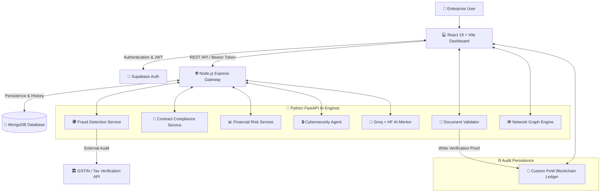

<div align="center">

# 🛡️ AegisAI
### Next-Generation Multi-Agent Business Risk & Compliance Intelligence Platform

[](https://react.dev/)
[](https://nodejs.org/)
[](https://fastapi.tiangolo.com/)
[](https://pytorch.org/)
[](https://mongodb.com/)
[](https://supabase.com/)
[](https://docker.com/)
[](LICENSE)

*An autonomous, AI-powered command center that unifies financial fraud detection, legal contract compliance, document forgery validation, cybersecurity threat analysis, and blockchain audit logging into a single cohesive ecosystem.*

</div>

---

## 🌟 Overview

Modern enterprises process thousands of invoices, contracts, financial statements, and digital transactions daily. Manually reviewing these workflows for fraud, regulatory compliance gaps, forged certificates, or cybersecurity threats is slow, fragmented, and highly error-prone.

**AegisAI** solves this by bridging modern web engineering, distributed microservices, advanced machine learning, and cryptographic blockchain persistence. It deploys **seven specialized AI microservices** alongside an **autonomous AI Mentor** to protect business operations in real time.

---

## ✨ Core AI Microservices & Features

| Module | Engine & Tech Stack | Description |
| :--- | :--- | :--- |
| 🕵️ **Invoice Fraud Detection** | XGBoost, Random Forest, Tesseract OCR | Analyzes structured (CSV/Excel) and unstructured (PDF/Image) invoices for duplicate billings, inflated amounts, vendor blacklists, and anomaly scoring. |
| 📜 **Contract Compliance Analyzer** | NLP, SentenceTransformers, FastAPI | Evaluates legal agreements and corporate contracts against required regulatory clauses, flagging missing terms and legal exposure. |
| 🪪 **Document Forgery Validator** | PyTorch, torchvision, Deep Learning | Detects manipulated or forged certificates, invoices, and contracts using deep convolutional neural networks and error-level analysis. |
| 📊 **Financial Distress Agent** | Accounting Ratios, Predictive ML | Predicts corporate solvency and bankruptcy risk using multi-year financial ratios and distress classification models. |
| 🔒 **Cybersecurity URL Agent** | Real-time Feature Extraction, ML | Inspects URLs and web endpoints for phishing patterns, suspicious entropy, and malicious hosting signatures. |
| 🕸️ **Network Risk Graph** | NetworkX, React Force Graph 2D | Visualizes complex vendor-to-company financial flows and relationship networks to expose collusion rings and hidden shell entities. |
| ⛓️ **Blockchain Audit Ledger** | Proof-of-Work, SHA-256, RSA Signatures | Persists critical analysis results and document verification proofs on a custom, tamper-evident cryptographic blockchain ledger. |
| 🤖 **AI Mentor Hub** | Groq (LLaMA-3), HuggingFace, RAG | An intelligent conversational assistant that translates complex ML risk scores and legal findings into plain English executive summaries. |

---

## 🏗️ System Architecture

AegisAI operates on a decoupled, highly scalable microservice architecture. The **React + Vite** dashboard interacts with an **Express API Gateway** protected by **Supabase JWT Authentication**. High-throughput ML workflows are routed asynchronously to specialized **Python FastAPI** engines.



---

## 🛠️ Technology Stack

### 💻 Frontend (Client Application)
* **Framework:** React 19, Vite, React Router DOM
* **Styling & UI:** Tailwind CSS, Lucide React Icons, Glassmorphism UI
* **Data Visualization:** Recharts (Interactive Analytics), React Force Graph 2D (Network Collusion Rings)
* **State & HTTP:** React Context API, Axios, React Hot Toast

### 🌐 Backend (API Gateway & Persistence)
* **Server:** Node.js, Express.js (RESTful architecture)
* **Database:** MongoDB with Mongoose ODM
* **Security & Auth:** Supabase Auth, JWT Bearer Token validation, Helmet, CORS, Express Rate Limit
* **File Processing:** Multer, pdf-parse, ExcelJS, xlsx, csv-parser

### 🧠 Machine Learning & AI Engines
* **API Framework:** Python 3.12, FastAPI, Uvicorn, Pydantic
* **Classical ML & NLP:** scikit-learn, XGBoost, pandas, numpy, joblib, SentenceTransformers
* **Deep Learning & Computer Vision:** PyTorch, torchvision, Tesseract OCR (`pytesseract`)
* **Graph & LLM:** NetworkX, Groq SDK (LLaMA-3 70B), HuggingFace Inference API

### 🔗 Blockchain & Cryptography
* **Ledger Implementation:** Custom Python Proof-of-Work (PoW) Blockchain
* **Cryptographic Primitives:** SHA-256 Merkle Trees, RSA Public/Private Key Signatures (`cryptography`)

---

## 📂 Repository Structure

```text
AegisAI/
├── frontend/                  # React 19 + Vite Dashboard & Client UI
│   ├── src/
│   │   ├── components/        # Reusable UI widgets, Uploaders, Graph charts
│   │   ├── pages/             # Dashboard, AIMentorHub, CyberSecurity, Fraud, etc.
│   │   ├── services/          # Axios API clients & endpoints
│   │   └── contexts/          # Supabase Auth Session Provider
│   └── Dockerfile             # Container configuration for frontend
│
├── backend/                   # Node.js + Express API Gateway & Auth Layer
│   ├── src/
│   │   ├── controllers/       # Route handlers (Fraud, Compliance, Mentor, Uploads)
│   │   ├── models/            # Mongoose schemas (AuditLog, Scan, User)
│   │   ├── routes/            # API routing definitions
│   │   ├── services/          # Microservice proxies & document parsers
│   │   └── middleware/        # Supabase JWT authentication & Rate limiting
│   └── Dockerfile             # Container configuration for API Gateway
│
├── ml-services/               # Python FastAPI Microservices Ecosystem
│   ├── fraud-service/         # Invoice anomaly scoring & Tesseract OCR engine
│   ├── compliance-service/    # Legal contract NLP clause classifier
│   ├── document-validator/    # PyTorch document forgery detection neural net
│   ├── financial-risk-agent/  # Corporate bankruptcy & accounting ratio model
│   ├── cybersecurity-agent/   # Phishing URL entropy & feature classifier
│   ├── graph-service/         # NetworkX collusion ring & relationship analyzer
│   └── blockchain-service/    # Custom cryptographic PoW ledger & audit API
│
├── docker-compose.yml         # Multi-container orchestration (MongoDB, Gateway, UI)
└── README.md                  # Project Documentation
```

---

## 🚀 Quickstart & Installation

You can run AegisAI either using **Docker Compose** (recommended for quick evaluation) or **Manually** for local development.

### Option 1: Docker Compose (Recommended)
Ensure you have [Docker](https://www.docker.com/) and Docker Desktop installed.

```bash
# 1. Clone the repository
git clone https://github.com/Naurezzz/Nexathon.git
cd Nexathon

# 2. Start the orchestrated stack (MongoDB, Backend Gateway, Frontend UI, Fraud Service)
docker-compose up --build -d

# 3. Access the application
# Frontend Dashboard: http://localhost:5173
# API Gateway:        http://localhost:5000
```

---

### Option 2: Manual Local Development

#### 1. Prerequisites
* Node.js (v18+) & npm
* Python (v3.10+) & pip
* MongoDB running locally on port `27017` (or MongoDB Atlas URI)

#### 2. Backend Gateway Setup
```bash
cd backend
npm install

# Create a .env file based on environment requirements
cat <<EOT >> .env
PORT=5000
MONGODB_URI=mongodb://localhost:27017/aegisai
SUPABASE_URL=your_supabase_project_url
SUPABASE_ANON_KEY=your_supabase_anon_key
GROQ_API_KEY=your_groq_api_key
EOT

# Start development server
npm run dev
```

#### 3. Frontend Dashboard Setup
```bash
cd ../frontend
npm install

# Start Vite development server
npm run dev
```

#### 4. ML Microservices Setup
Each ML microservice is self-contained. To run any service (e.g., Fraud Service):
```bash
cd ../ml-services/fraud-service
python -m venv venv
# Windows: venv\Scripts\activate | Mac/Linux: source venv/bin/activate
pip install -r requirements.txt

# Start FastAPI server
python serve.py
# Server runs on http://localhost:8000 (Swagger docs at /docs)
```

---

## 🔐 Security & Best Practices

1. **Zero Hardcoded Secrets:** All credentials, database connection strings, and LLM API keys (`GROQ_API_KEY`, `HUGGINGFACE_API_KEY`, Supabase keys) are strictly loaded via runtime environment variables (`process.env` / `os.getenv`).
2. **Tamper-Evident Audit Trails:** Verified analyses write SHA-256 Merkle roots to the standalone Proof-of-Work blockchain, preventing retrospective database manipulation.
3. **Role-Based Access Control (RBAC):** Supabase JWT metadata distinguishes between standard analysts and compliance administrators, enforcing strict endpoint authorization.

---

## 📄 License & Acknowledgments

This project is open-source and developed for enterprise risk intelligence innovation.
Distributed under the **MIT License**. See `LICENSE` for more information.

<div align="center">
<br />
<b>Built with ❤️ by the AegisAI Engineering Team</b>
</div>
